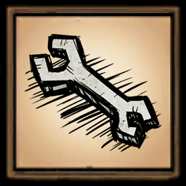

# dst-mod-dev-tools

[![GitHub Workflow CI Status][]](https://github.com/victorpopkov/dst-mod-dev-tools/actions?query=workflow%3ACI)
[![GitHub Workflow Documentation Status][]](https://github.com/victorpopkov/dst-mod-dev-tools/actions?query=workflow%3ADocumentation)
[![Codecov][]](https://codecov.io/gh/victorpopkov/dst-mod-dev-tools)

## Overview

Mod for the game [Don't Starve Together][] which is available through the
[Steam Workshop][] to improve the development/testing experience:
https://steamcommunity.com/app/322330/workshop/

It was inspired by an abandoned _DebugMenuScreen_ withing the game engine and
was designed as an alternative to _debugkeys_.

## Configuration

| Configuration                     | Default                 | Description                                             |
| --------------------------------- | ----------------------- | ------------------------------------------------------- |
| **Toggle menu key**               | _Rightbracket_          | Key used for toggling the in-game menu                  |
| **Movement prediction key**       | _Disabled_              | Key used for toggling the movement prediction           |
| **Pause key**                     | _P_                     | Key used for pausing the game                           |
| **God mode key**                  | _G_                     | Key used for toggling god mode                          |
| **Teleport key**                  | _T_                     | Key used for (fake) teleporting on mouse position       |
| **Select entity key**             | _Z_                     | Key used for selecting an entity under mouse            |
| **Increase time scale key**       | _Disabled_              | Key used to speed up the time scale                     |
| **Decrease time scale key**       | _Disabled_              | Key used to slow down the time scale                    |
| **Default time scale key**        | _Disabled_              | Key used to restore the default time scale              |
| **Reset combination**             | _Ctrl + R_              | Key combination used for reloading all mods             |
| **Default god mode**              | _Yes_                   | Should the god mode be enabled by default?              |
| **Default free crafting mode**    | _Yes_                   | Should the free crafting mode be enabled by default?    |
| **Default labels font**           | _Stint Ultra Condensed_ | Which labels font should be used by default?            |
| **Default labels font size**      | _18_                    | Which labels font size should be used by default?       |
| **Default selected labels**       | _Yes_                   | Should the selected labels be enabled by default?       |
| **Default username labels**       | _No_                    | Should the username labels be enabled by default?       |
| **Default username labels mode**  | _Default_               | Which username labels mode should be used by default?   |
| **Default forced HUD visibility** | _Yes_                   | Should the forced HUD visibility be enabled by default? |
| **Default forced unfading**       | _Yes_                   | Should the forced unfading be enabled by default?       |
| **Disable mod warning**           | _Yes_                   | Should the mod warning be disabled?                     |
| **Debug**                         | _No_                    | Should the debug mode be enabled?                       |

## Documentation

The [LDoc][] documentation generator has been used for generating documentation,
and the most recent version can be found here:
http://github.victorpopkov.com/dst-mod-dev-tools/

- [Installation](readme/01-installation.md)
- [Development](readme/02-development.md)
- [API](readme/03-api.md)
- [Extending](readme/04-extending.md)

## License

Released under the [MIT License](https://opensource.org/licenses/MIT).

[don't starve together]: https://www.klei.com/games/dont-starve-together
[github workflow ci status]: https://github.com/victorpopkov/dst-mod-dev-tools/workflows/CI/badge.svg
[github workflow documentation status]: https://github.com/victorpopkov/dst-mod-dev-tools/workflows/Documentation/badge.svg
[ldoc]: https://stevedonovan.github.io/ldoc/
[steam workshop]: https://steamcommunity.com/app/322330/workshop/
